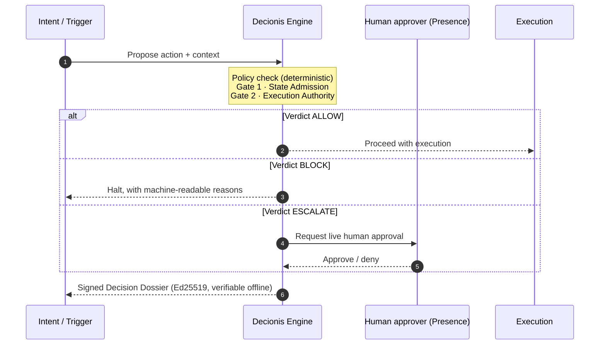

<div align="center">

# Decionis

### The deterministic decision layer between intent and execution.

*Before AI acts, Decionis decides.*

[](https://github.com/decionis/.github/blob/master/LICENSE)
[](https://decionis.com/?utm_source=github&utm_medium=org_readme&utm_campaign=dev_discovery)
[](https://decionis.com/docs?utm_source=github&utm_medium=org_readme&utm_campaign=dev_discovery)
[](https://decionis.com/docs?utm_source=github&utm_medium=org_readme&utm_campaign=dev_discovery)
[](https://board.decionis.com/?utm_source=github&utm_medium=org_readme&utm_campaign=dev_discovery)
[](https://decionis.com/policy-exchange?utm_source=github&utm_medium=org_readme&utm_campaign=dev_discovery)

</div>

---

AI agents open pull requests, trigger deploys, issue refunds, and change production state. Decionis sits between the moment something *wants* to act and the moment it *does*: every high-stakes action is checked against policy **deterministically** — same input, same verdict — and receives **ALLOW**, **BLOCK**, or **ESCALATE** in under 120 ms, sealed as a cryptographically signed **Decision Dossier** you can verify offline.

## 🚀 Start here — pick your surface

| Purpose / Domain | Repository / Package | Quick start | Links |
| --- | --- | --- | --- |
| **CI/CD Action Gate** — gate risky workflow steps: deploys, AI-generated PRs, Terraform applies | [`decionis/govern`](https://github.com/decionis/govern) | `uses: decionis/govern@v1` | [Docs](https://decionis.com/docs/quickstart?utm_source=github&utm_medium=org_readme&utm_campaign=dev_discovery) · [Playground](https://board.decionis.com/?utm_source=github&utm_medium=org_readme&utm_campaign=dev_discovery) |
| **Agent Tool Control (MCP)** — a permission layer between LLM agents and their tools | [`decionis/mcp`](https://github.com/decionis/mcp) | `npx @decionis/mcp` | [Docs](https://decionis.com/docs/protocol-mcp?utm_source=github&utm_medium=org_readme&utm_campaign=dev_discovery) · [Playground](https://board.decionis.com/?utm_source=github&utm_medium=org_readme&utm_campaign=dev_discovery) |
| **Application SDK** — request verdicts from your own services and apps | [`decionis/sdk`](https://github.com/decionis/sdk) | `npm install @decionis/sdk` | [Docs](https://decionis.com/docs/api?utm_source=github&utm_medium=org_readme&utm_campaign=dev_discovery) · [Playground](https://board.decionis.com/?utm_source=github&utm_medium=org_readme&utm_campaign=dev_discovery) |
| **Offline Verifier** — independently verify any signed Decision Dossier | [`decionis/verify`](https://github.com/decionis/verify) | `npx @decionis/verify dossier.json` | [Docs](https://decionis.com/verify/decision-dossiers?utm_source=github&utm_medium=org_readme&utm_campaign=dev_discovery) · [Playground](https://board.decionis.com/?utm_source=github&utm_medium=org_readme&utm_campaign=dev_discovery) |

> 🕹️ **No account needed** — run a live policy check in the [Sandbox](https://decionis.com/sandbox?utm_source=github&utm_medium=org_readme&utm_campaign=dev_discovery), or open the [Board](https://board.decionis.com/?utm_source=github&utm_medium=org_readme&utm_campaign=dev_discovery) to see verdicts and dossiers in real time.

## 🧭 How it works



1. **Intent / Trigger** — a CI job step, an AI agent's tool call, or an API request declares what it wants to do *before* doing it.
2. **Decionis Engine (policy check)** — the dual-gate engine evaluates the action deterministically: Gate 1 admits the claimed state, Gate 2 decides execution authority. Same input, same verdict, in under 120 ms.
3. **Verdict** — **ALLOW** lets execution proceed, **BLOCK** halts it with reasons, **ESCALATE** routes to a live human check via [Presence](https://presence.decionis.com/?utm_source=github&utm_medium=org_readme&utm_campaign=dev_discovery).
4. **Signed Decision Dossier** — every verdict ships as an Ed25519-signed, immutable audit record. Verify it offline with [`decionis/verify`](https://github.com/decionis/verify) — no API call, no trust in us required.

<details>
<summary><b>🔏 What a Decision Dossier looks like</b></summary>

```json
{
  "dossier": "dsr_2026_9f2ka8",
  "action": "deploy.production",
  "verdict": "ALLOW",
  "policy": "prod-deploy-gate@v3",
  "gates": { "state_admission": "pass", "execution_authority": "pass" },
  "latency_ms": 42,
  "alg": "ed25519",
  "sig": "kQ4vR…8zPw"
}
```

</details>

## 🤝 Community & contributing

- **Contribute** — read our [contributing guide](https://github.com/decionis/.github/blob/master/CONTRIBUTING.md) and open issues with the [structured templates](https://github.com/decionis/.github/tree/master/ISSUE_TEMPLATE). We welcome bug reports, policy templates, connectors, and docs.
- **Security** — found a vulnerability? **Don't open a public issue** — see our [security policy](https://github.com/decionis/.github/blob/master/SECURITY.md) or email [security@decionis.com](mailto:security@decionis.com).
- **Policy Exchange** — share and reuse community policy templates on the [Policy Exchange](https://decionis.com/policy-exchange?utm_source=github&utm_medium=org_readme&utm_campaign=dev_discovery).
- **Talk to us** — questions about the hosted platform or integrations: [contact](https://decionis.com/contact?utm_source=github&utm_medium=org_readme&utm_campaign=dev_discovery).
- We follow the [Contributor Covenant Code of Conduct](https://github.com/decionis/.github/blob/master/CODE_OF_CONDUCT.md).

---

<div align="center">

**[decionis.com](https://decionis.com/?utm_source=github&utm_medium=org_readme&utm_campaign=dev_discovery)** · [Docs](https://decionis.com/docs?utm_source=github&utm_medium=org_readme&utm_campaign=dev_discovery) · [Integrations](https://decionis.com/integrations?utm_source=github&utm_medium=org_readme&utm_campaign=dev_discovery) · [Board](https://board.decionis.com/?utm_source=github&utm_medium=org_readme&utm_campaign=dev_discovery)

*Every high-stakes action asks permission — and receives a signed Decision Dossier.*

</div>
