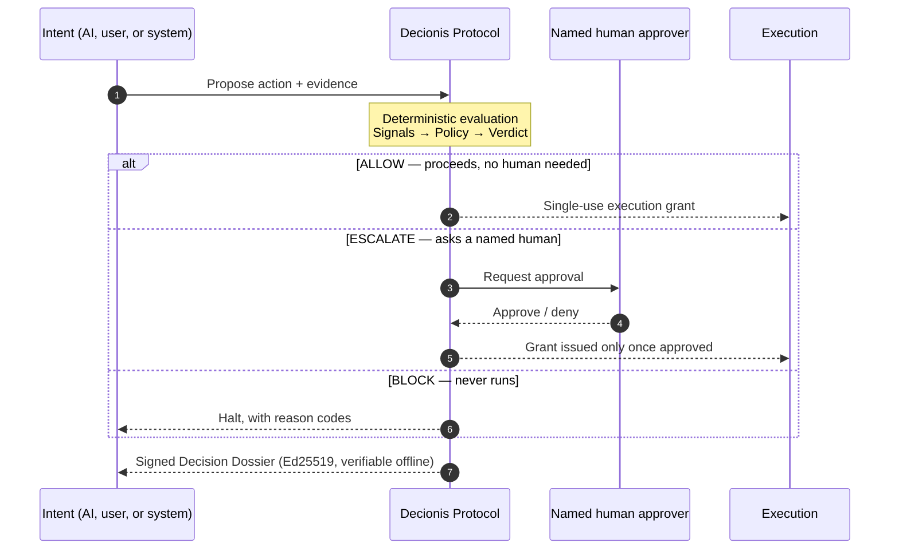

<div align="center">

# Decionis

### The independent Execution Authority for AI agents.

*Before AI acts, Decionis decides.*

[](https://github.com/decionis/.github/blob/master/LICENSE)
[](https://decionis.com/?utm_source=github&utm_medium=org_readme&utm_campaign=dev_discovery)
[](https://decionis.com/docs?utm_source=github&utm_medium=org_readme&utm_campaign=dev_discovery)
[](https://decionis.com/docs?utm_source=github&utm_medium=org_readme&utm_campaign=dev_discovery)
[](https://decionis.com/sandbox?utm_source=github&utm_medium=org_readme&utm_campaign=dev_discovery)
[](https://decionis.com/policy-exchange?utm_source=github&utm_medium=org_readme&utm_campaign=dev_discovery)

</div>

---

Before an AI agent refunds $450, releases a $25,000 payout, changes production data, or triggers a deploy, Decionis evaluates that exact action against **your** policy **deterministically** — same input, same verdict — and returns, in under 120 ms, the verdict your systems enforce:

- **ALLOW** — proceeds, no human needed
- **ESCALATE** — asks a named human
- **BLOCK** — never runs

Authorized actions get a **single-use execution grant**; every verdict becomes an Ed25519-signed **Decision Dossier** anyone can verify — offline, no account needed. Gateways decide where an action can go. Decionis decides whether it has authority to happen.

## 🚀 Start here — pick your surface

| Purpose / Domain | Repository / Package | Quick start | Links |
| --- | --- | --- | --- |
| **Agent Tool Control (MCP)** — a policy gate between LLM agents and their tools, with native Claude Code, Codex, and Copilot hooks | [`decionis/mcp`](https://github.com/decionis/mcp) | `npx -y --package=@decionis/mcp decionis-mcp` | [Docs](https://decionis.com/docs/protocol-mcp?utm_source=github&utm_medium=org_readme&utm_campaign=dev_discovery) · [Sandbox](https://decionis.com/sandbox?utm_source=github&utm_medium=org_readme&utm_campaign=dev_discovery) |
| **CI/CD Action Gate** — govern any GitHub workflow step on a signed Decision Dossier: deploys, releases, infra changes; shadow or enforce | [`decionis/govern`](https://github.com/decionis/govern) | `uses: decionis/govern@v1` | [Docs](https://decionis.com/docs/quickstart?utm_source=github&utm_medium=org_readme&utm_campaign=dev_discovery) · [Sandbox](https://decionis.com/sandbox?utm_source=github&utm_medium=org_readme&utm_campaign=dev_discovery) |
| **Agents in Docker** — the containerized MCP gate plus a Docker Desktop extension for observing governed agent activity | [`decionis/docker`](https://github.com/decionis/docker) | `docker pull decionis/mcp` | [Docker Hub](https://hub.docker.com/r/decionis/mcp) · [Sandbox](https://decionis.com/sandbox?utm_source=github&utm_medium=org_readme&utm_campaign=dev_discovery) |
| **Application SDK** — ask the hosted protocol for a verdict on a proposed action from your own code | [`@decionis/sdk`](https://www.npmjs.com/package/@decionis/sdk) | `npm install @decionis/sdk` | [API reference](https://decionis.com/docs/api?utm_source=github&utm_medium=org_readme&utm_campaign=dev_discovery) · [Quickstart](https://decionis.com/docs/quickstart?utm_source=github&utm_medium=org_readme&utm_campaign=dev_discovery) |
| **Dossier verification** — independently verify any signed Decision Dossier, offline | [`@decionis/verify`](https://www.npmjs.com/package/@decionis/verify) | `npm install @decionis/verify` | [Verify a dossier](https://decionis.com/verify/decision-dossiers?utm_source=github&utm_medium=org_readme&utm_campaign=dev_discovery) · [Example dossier](https://decionis.com/dossier-example?utm_source=github&utm_medium=org_readme&utm_campaign=dev_discovery) |
| **Commerce margin protection** — margin floors, discount stacking, and oversell, decided before the order commits | Decionis Checkout Gate | [Install on Shopify](https://apps.shopify.com/decionis-checkout-gate) — read-only Shadow Mode on day zero | [Commerce](https://decionis.com/commerce?utm_source=github&utm_medium=org_readme&utm_campaign=dev_discovery) · [Shadow Mode](https://decionis.com/shadow-mode?utm_source=github&utm_medium=org_readme&utm_campaign=dev_discovery) |
| **Consumer spending authority (Shield)** — apps and AI agents ask before money moves: **ALLOW**, **ASK**, or **BLOCK** | [`decionis/shield-js`](https://github.com/decionis/shield-js) · [`decionis/shield-swift`](https://github.com/decionis/shield-swift) | `npm install @decionis/shield` | [Shield](https://decionis.com/shield?utm_source=github&utm_medium=org_readme&utm_campaign=dev_discovery) · [App Store](https://apps.apple.com/us/app/decionis-shield/id6787201626) |
| **Human presence verification** — verify who is really present before escalated actions execute (Go · Swift · Kong Gateway) | [`decionis/presence-go`](https://github.com/decionis/presence-go) · [`decionis/presence-swift`](https://github.com/decionis/presence-swift) · [`decionis/kong-plugin-presence`](https://github.com/decionis/kong-plugin-presence) | `go get github.com/decionis/presence-go@v0.2.0` | [Docs](https://presence.decionis.com/developers/quickstart?utm_source=github&utm_medium=org_readme&utm_campaign=dev_discovery) · [Kong](https://presence.decionis.com/developers/kong?utm_source=github&utm_medium=org_readme&utm_campaign=dev_discovery) |
| **Customer-ops decisioning (Steward)** — correlate account evidence and route every operator review through a policy verdict | [`decionis/steward`](https://github.com/decionis/steward) | [Live demo](https://decionis-steward.vercel.app) — no account, nothing to install | [Repository](https://github.com/decionis/steward) |
| **Reference architecture** — agents propose actions but cannot authorize them: intent capture → verdict → human approval → a SafeExecutor consuming a single-use intent-bound grant | [`decionis/agent-safe-pipeline`](https://github.com/decionis/agent-safe-pipeline) | `gh repo clone decionis/agent-safe-pipeline` | [Architecture](https://github.com/decionis/agent-safe-pipeline/blob/main/ARCHITECTURE.md) · [Threat model](https://github.com/decionis/agent-safe-pipeline/blob/main/THREAT-MODEL.md) |

> 🕹️ **No account needed** — run a live policy check in the [Sandbox](https://decionis.com/sandbox?utm_source=github&utm_medium=org_readme&utm_campaign=dev_discovery) and watch a real verdict and signed dossier come back.
>
> 🕶️ **Start without changing production** — [Shadow Mode](https://decionis.com/shadow-mode?utm_source=github&utm_medium=org_readme&utm_campaign=dev_discovery) evaluates your real traffic read-only: nothing is held or blocked until you enable enforcement.
>
> 🤖 **AI agents start at [decionis.com/llms.txt](https://decionis.com/llms.txt).**

## 🧭 How it works



1. **Intent** — an AI agent's tool call, a CI job step, a checkout, or an API request declares what it wants to do *before* doing it.
2. **Decision** — the **Decionis Protocol** evaluates that exact action against version-pinned policy, deterministically: signals → policy → verdict, same input, same verdict, in under 120 ms. Decionis holds no policy of its own — it applies the rules your team authored, approved, and versioned.
3. **Verdict** — **ALLOW** proceeds with a **single-use execution grant**, no human needed. **ESCALATE** asks a named human in your organisation and proceeds only once approved. **BLOCK** never runs. On the wire: `POST /v1/authority/enforce-and-bind → {"status":"ALLOW","execution_token":"exec_tok_…","dossier_id":"dos_…"}`.
4. **Record** — every verdict ships as an Ed25519-signed, immutable **Decision Dossier**. Check the signature against our published JWKS — offline, [no account](https://decionis.com/verify/decision-dossiers?utm_source=github&utm_medium=org_readme&utm_campaign=dev_discovery), and no need to trust our code for the result to mean something.

<details>
<summary><b>🔏 What a Decision Dossier looks like</b></summary>

```json
{
  "dossier_id": "DSR-EXAMPLE-7F92-AC11",
  "action": "Vendor payment",
  "verdict": "ESCALATE",
  "reason": "CFO approval required",
  "policy_version": "finance_controls_v4.2",
  "latency_ms": 18,
  "signature": "ed25519:sample-proof-4f8c9a1b7e2d6c0a9b5e3f1d"
}
```

Read this record end to end on the [example dossier page](https://decionis.com/dossier-example?utm_source=github&utm_medium=org_readme&utm_campaign=dev_discovery).

</details>

## 🤝 Community & contributing

- **Contribute** — read our [contributing guide](https://github.com/decionis/.github/blob/master/CONTRIBUTING.md) and open issues with the [structured templates](https://github.com/decionis/.github/tree/master/ISSUE_TEMPLATE). We welcome bug reports, policy templates, connectors, and docs.
- **Security** — found a vulnerability? **Don't open a public issue** — see our [security policy](https://github.com/decionis/.github/blob/master/SECURITY.md) or email [security@decionis.com](mailto:security@decionis.com).
- **Policy Exchange** — share and reuse community policy templates on the [Policy Exchange](https://decionis.com/policy-exchange?utm_source=github&utm_medium=org_readme&utm_campaign=dev_discovery).
- **Talk to us** — questions about the hosted platform or integrations: [contact](https://decionis.com/contact?utm_source=github&utm_medium=org_readme&utm_campaign=dev_discovery).
- We follow the [Contributor Covenant Code of Conduct](https://github.com/decionis/.github/blob/master/CODE_OF_CONDUCT.md).

---

<div align="center">

**[decionis.com](https://decionis.com/?utm_source=github&utm_medium=org_readme&utm_campaign=dev_discovery)** · [Docs](https://decionis.com/docs?utm_source=github&utm_medium=org_readme&utm_campaign=dev_discovery) · [Integrations](https://decionis.com/integrations?utm_source=github&utm_medium=org_readme&utm_campaign=dev_discovery) · [Sandbox](https://decionis.com/sandbox?utm_source=github&utm_medium=org_readme&utm_campaign=dev_discovery)

*Nothing reaches execution without passing through the decision.*

<sub>SOC 2 in progress · EU AI Act Art. 12 mapped · ISO 27001 planned · © 2026 Decionis, Inc. — a Delaware/US corporation</sub>

</div>
